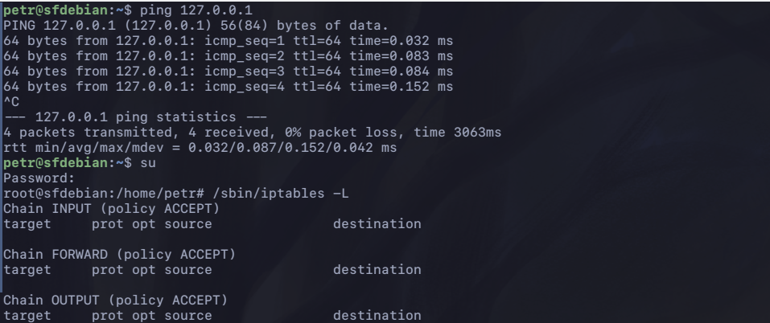
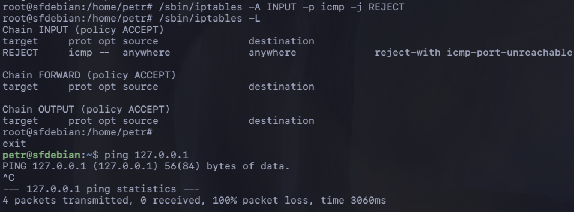
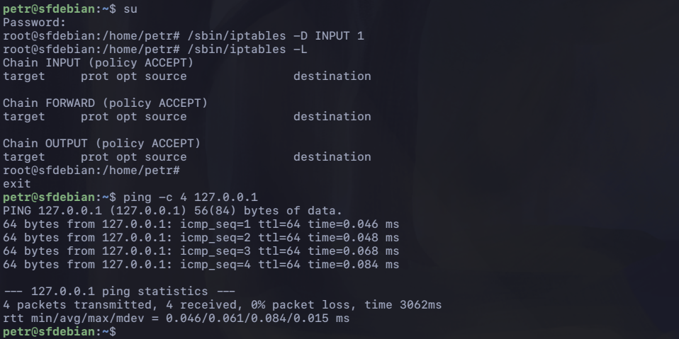

# Homework with iptables basics

[Whole process in one picture](./assets/same-on-jammy.png) - as proof of correct timeline and command order. **Date and time are also here**. Remake on jammy.

## 1. no rule, ping works



## 2. rule enabled, ping fails

```bash
sudo iptables -A INPUT -p icmp -j REJECT
```



## 3. rule deleted, ping works again

```bash
sudo iptables -D INPUT 1
```


